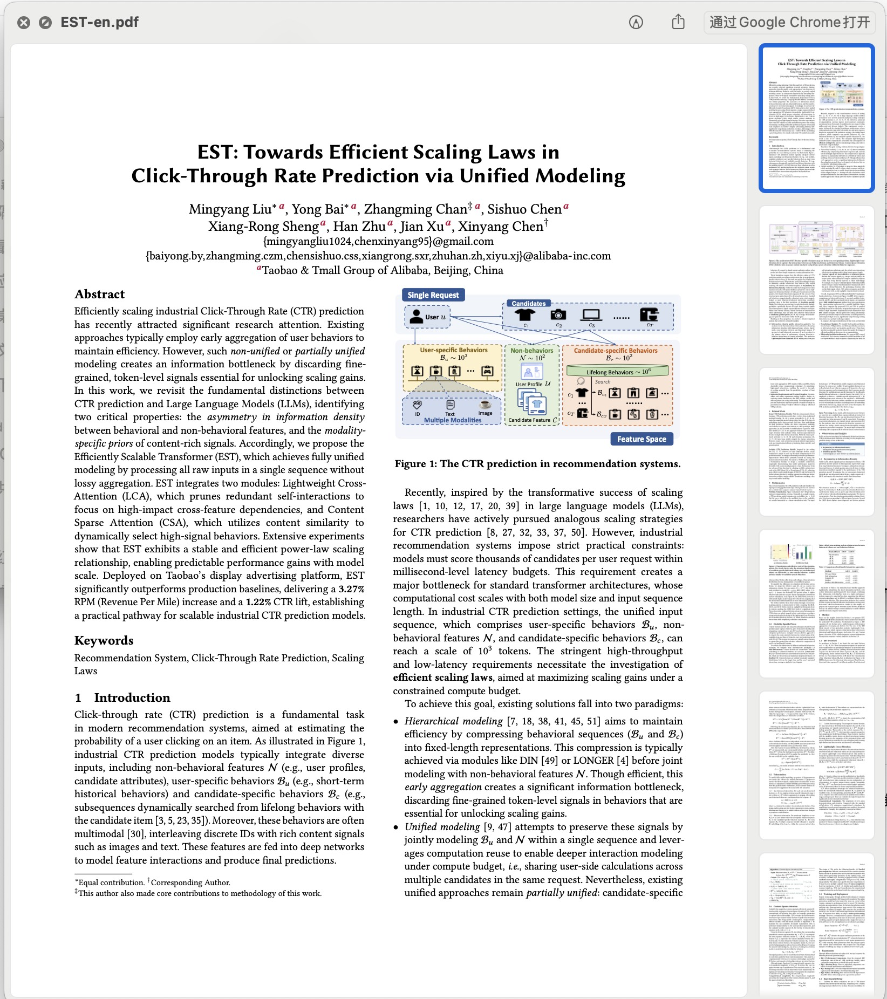
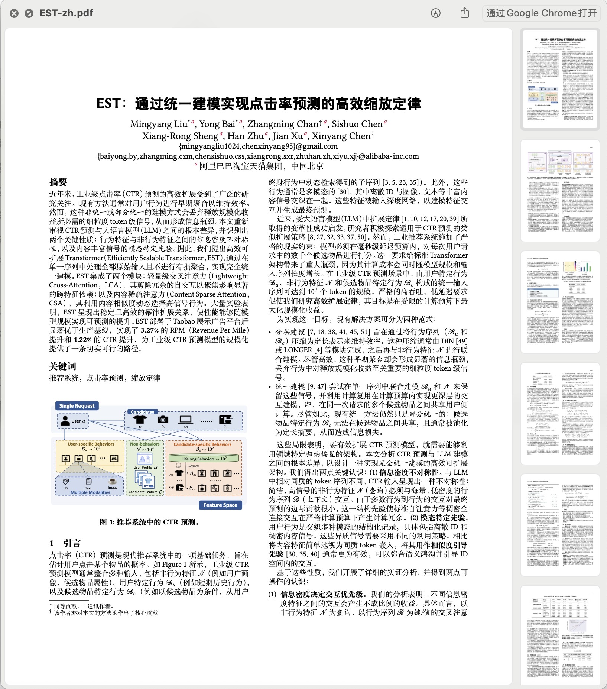

# arxiv-paper-zh

[](https://www.npmjs.com/package/arxiv-paper-zh)
[](LICENSE)

将 arXiv/LaTeX 论文快速转换为可编译的中文版本。该 Agent Skill 会先核验论文身份，再下载 TeX 源码，按内容量并行翻译，自动检查漏译与 TeX 依赖，最后使用 XeLaTeX 编译并逐页检查 PDF。

方案参考了科学空间的[《让 AI 翻译一篇完整的论文》](https://spaces.ac.cn/archives/11578)，并针对 Codex、Claude Code 等 Agent Skills 兼容环境补充了并行分片、依赖缓存、自动审计和可重复构建流程。

## 翻译效果

| 英文原版 | 中文译版 |
| :---: | :---: |
|  |  |

在保留论文版式、公式、引用与插图的同时，将标题、摘要、正文、章节标题和图注转换为中文。

## 快速开始

```bash
npx arxiv-paper-zh@latest install --all
```

重新开启 Agent 会话，然后输入：

```text
$arxiv-paper-zh 翻译 arXiv:2507.15551
```

npm 包地址：[arxiv-paper-zh](https://www.npmjs.com/package/arxiv-paper-zh)。

## 功能

- 核对论文简称、标题、作者、摘要、URL 与 arXiv ID，避免翻错同名论文。
- 按 `arxiv-paper/<paper-name>/` 统一保存原始源码、中文源码以及中英文 PDF。
- 将可见英文切成紧凑任务包，公式、引用、URL、代码和注释使用可逆占位符，不再让模型重复读取整份 TeX。
- 默认每个任务包最多包含 2,000 个估算可见英文词；任务包与 worker 数量分开控制，长论文分批并行、短论文自动减少 worker。
- 原文任务包只读，worker 只输出包含片段 ID 和译文的结果文件，避免重复输出原文。
- 保留公式、数值、引用键、标签、人名、模型名、数据集名和常用缩写。
- 翻译正文、章节标题、脚注、表头、表注和 caption。
- 参考文献标题与条目保持原文，并在翻译分片和漏译审计中自动跳过。
- 批量检查并安装缺失的 TeX 宏包，复用共享 TinyTeX/TeX Live 缓存。
- 自动执行漏译审计、BibTeX/Biber 构建和引用收敛检查。
- 工具默认返回摘要和下一批任务；完整检查列表按需展开，构建与安装日志留在本地。
- 每包完成即可校验并保存断点；自动为失败片段生成修复包，保留已通过的译文。
- 支持恢复翻译进度和中断的源码合并，重复合并不会再次替换已完成的内容。
- 编译按辅助文件与引用的实际收敛情况结束；输入、依赖及成品哈希匹配时跳过重复构建。
- 页面图片按 PDF、分辨率和工具版本缓存，缺失或损坏时只补渲染受影响的页面。
- 使用 XeLaTeX 生成中文 PDF，并要求逐页视觉核验。

## 项目结构

```text
arxiv-paper-zh/
├── .codex-plugin/
│   └── plugin.json
├── .agents/
│   └── plugins/
│       └── marketplace.json
├── assets/
│   ├── en.jpg
│   └── zh.jpg
├── bin/
│   └── arxiv-paper-zh.mjs
├── skills/
│   └── arxiv-paper-zh/
│       ├── SKILL.md
│       ├── agents/
│       │   └── openai.yaml
│       ├── scripts/
│       │   ├── artifact_cache.py
│       │   ├── audit_tex_translation.py
│       │   ├── build_and_check.py
│       │   ├── finalize_output.py
│       │   ├── inventory_and_shard.py
│       │   ├── prepare_output_layout.py
│       │   ├── prepare_tex_runtime.py
│       │   ├── render_pdf.py
│       │   ├── translation_tasks.py
│       │   ├── translation_progress.py
│       │   └── tex_translation_utils.py
│       └── references/
│           ├── build-and-render.md
│           ├── paper-translation-packages.txt
│           └── translation-recovery.md
├── install.sh
├── package.json
├── tests/
│   ├── installer.test.mjs
│   ├── test_bibliography_exclusion.py
│   ├── test_build_cache.py
│   ├── test_cli_output.py
│   ├── test_output_layout.py
│   ├── test_render_pdf.py
│   ├── test_translation_tasks.py
│   └── test_translation_progress.py
├── .gitignore
└── README.md
```

`skills/arxiv-paper-zh/` 是可以被 Agent 独立加载的完整 Skill；根目录同时提供 Codex Plugin manifest、npm/npx 安装器和原有 Shell 安装器。

## 环境要求

- macOS 或 Linux。
- Python 3.9 或更高版本。
- 可执行 `curl`、`tar` 等常用命令。
- Codex、Claude Code，或其他支持 [Agent Skills 开放格式](https://agentskills.io/) 的客户端。
- 编译时需要 XeLaTeX。可以使用系统 TeX Live，也可以让 Skill 准备并复用 TinyTeX。
- 页面渲染需要 Poppler 的 `pdfinfo` 和 `pdftoppm`；中文字体还需用支持 CJK 的另一 PDF 引擎抽查。
- 第一次下载论文源码或安装缺失宏包时需要网络连接。

TeX 运行时不包含在本仓库中，避免让仓库体积增加数百 MB。不同论文缺少的宏包会被批量安装到共享运行时。

## 安装

### 使用 npm / npx（推荐）

无需先克隆仓库，可直接安装到 Codex 和 Claude Code：

```bash
npx arxiv-paper-zh@latest install
```

安装到 Codex、Claude Code 和通用 Agent Skills 目录：

```bash
npx arxiv-paper-zh@latest install --all
```

也可以选择单个客户端或安装到指定项目：

```bash
npx arxiv-paper-zh@latest install --codex
npx arxiv-paper-zh@latest install --claude
npx arxiv-paper-zh@latest install --agents
npx arxiv-paper-zh@latest install --project /path/to/project --all
```

npm 安装器会复制完整 Skill 目录。目标已存在时默认停止；明确需要升级或替换时增加 `--force`。

更新已有的 npm 安装：

```bash
npx arxiv-paper-zh@latest install --all --force
```

### 作为 Codex Plugin 安装

本仓库同时是一个 Codex Plugin，并通过仓库内的 marketplace 从 npm registry 获取版本化包：

```bash
codex plugin marketplace add yqstar/arxiv-paper-zh --ref main
codex plugin add arxiv-paper-zh@arxiv-paper-zh
```

### 从源码一键安装到 Codex 和 Claude Code

```bash
git clone https://github.com/yqstar/arxiv-paper-zh.git
cd arxiv-paper-zh
./install.sh --all
```

安装脚本默认创建符号链接，因此更新仓库后各客户端会立即使用新版本。它不会覆盖已经存在的同名 Skill。

### 仅安装到指定环境

```bash
./install.sh --codex
./install.sh --claude
./install.sh --agents
```

对应的用户级目录为：

| 环境 | 安装位置 |
| --- | --- |
| Codex | `~/.codex/skills/arxiv-paper-zh` |
| Claude Code | `~/.claude/skills/arxiv-paper-zh` |
| 通用 Agent Skills | `~/.agents/skills/arxiv-paper-zh` |

如果客户端已经启动，请重新开启会话；Claude Code 通常支持技能目录的热更新。

### 项目级安装

把 Skill 安装到某个仓库，仅供该项目使用：

```bash
./install.sh --project /path/to/project --agents
./install.sh --project /path/to/project --claude
```

这会分别创建：

- `/path/to/project/.agents/skills/arxiv-paper-zh`
- `/path/to/project/.claude/skills/arxiv-paper-zh`

### 手动安装

也可以直接复制或链接 Skill 子目录。例如：

```bash
ln -s "$(pwd)/skills/arxiv-paper-zh" ~/.codex/skills/arxiv-paper-zh
```

不要只复制 `SKILL.md`，因为工作流还依赖 `scripts/` 和 `references/`。

## 使用

安装后直接向 Agent 描述论文即可：

```text
使用 arxiv-paper-zh 翻译论文 RankMixer。
```

也可以提供更精确的信息：

```text
使用 arxiv-paper-zh 翻译 arXiv:2507.15551。保留公式、引用和人名，
将产物放到 arxiv-paper/RankMixer，分别编译并返回中英文 PDF。
```

Codex 中可显式调用：

```text
$arxiv-paper-zh 翻译 arXiv:2507.15551
```

Claude Code 中可直接输入自然语言，或在发现该 Skill 后使用：

```text
/arxiv-paper-zh 翻译 arXiv:2507.15551
```

如果简称可能对应多篇论文，Skill 会先返回候选论文的完整标题、作者与 arXiv ID，请用户确认后再下载。

安装或更新后若 Skill 没有立即出现，请重新开启 Agent 会话。

## 交付内容

每次任务均按论文简称建立固定目录。例如 `paper-name=EST`：

```text
arxiv-paper/EST/
├── latex/
│   ├── source.tar
│   ├── paper-en/
│   └── paper-zh/
├── paper-en/
│   └── EST-en.pdf
└── paper-zh/
    └── EST-zh.pdf
```

- `latex/source.tar`：从 arXiv 下载的原始压缩包。
- `latex/paper-en/`：未经翻译的英文源码。
- `latex/paper-zh/`：保持可编译性的中文源码副本。
- `paper-en/<paper-name>-en.pdf`：英文原版编译结果。
- `paper-zh/<paper-name>-zh.pdf`：中文译版编译结果。

原始下载物只允许保存为 `latex/source.tar`，不另建根级 `source/`、`source.tar` 或 `latex/source/` 中转路径。Agent 自建的渲染图、截图和诊断文件统一写入论文根目录的 `tmp/`；完整交付校验通过后自动删除该目录。

`paper-name` 使用用户熟悉的简短名称并保留大小写，例如 `EST`、`Onetrans`，且只能包含英文字母、数字、点、下划线和连字符。

整个参考文献部分保持原文，包括标题和全部条目；`.bib`、`.bbl`、内嵌 bibliography 环境和单独的参考文献 TeX 文件均不参与翻译。正文中的文献综述仍照常翻译。原图内部文字不修改，只翻译必要 caption。公式内的英文说明按“公式不变”原则保留。

## 内置工具

```bash
# 创建并输出固定的论文产物路径
python3 skills/arxiv-paper-zh/scripts/prepare_output_layout.py EST --root arxiv-paper

# 生成只读任务包（每包最多 2000 个估算英文词，最多 3 个并发 worker）
python3 skills/arxiv-paper-zh/scripts/translation_tasks.py prepare arxiv-paper/EST/latex/paper-zh --entry main.tex --workers 3 --packet-words 2000 --json

# worker 读取 packet-*.task，将译文写入对应 packet-*.result.jsonl
# 查看填写进度和下一批任务；主 Agent 避免重复分配正在处理的任务
python3 skills/arxiv-paper-zh/scripts/translation_tasks.py status arxiv-paper/EST/latex/paper-zh

# 每包完成立即校验；失败时生成仅含错误片段的修复包
python3 skills/arxiv-paper-zh/scripts/translation_tasks.py check arxiv-paper/EST/latex/paper-zh --packet packet-0001.task --json
python3 skills/arxiv-paper-zh/scripts/translation_tasks.py repair arxiv-paper/EST/latex/paper-zh --packet packet-0001.task --json

# worker 写好修复结果后，校验并接收，保留其余正确译文
python3 skills/arxiv-paper-zh/scripts/translation_tasks.py repair arxiv-paper/EST/latex/paper-zh --packet packet-0001.task --apply --json

# 中断后恢复进度；输入一致时也可完成中断的源码合并
python3 skills/arxiv-paper-zh/scripts/translation_tasks.py resume arxiv-paper/EST/latex/paper-zh --json

# 所有任务填写完后统一校验、合并
python3 skills/arxiv-paper-zh/scripts/translation_tasks.py apply arxiv-paper/EST/latex/paper-zh

# 检查预装包和论文专用宏包
python3 skills/arxiv-paper-zh/scripts/prepare_tex_runtime.py arxiv-paper/EST/latex/paper-zh --preset --kpsewhich /path/to/kpsewhich

# 扫描全部内容，默认展示前 10 条疑似漏译；有更多命中时加 --details 复核
python3 skills/arxiv-paper-zh/scripts/audit_tex_translation.py arxiv-paper/EST/latex/paper-zh

# 自动收敛构建，重复执行可命中缓存；完整输出保存在 EST/tmp/paper-zh-build.log
python3 skills/arxiv-paper-zh/scripts/build_and_check.py arxiv-paper/EST/latex/paper-zh/main.tex --tex-bin /path/to/tex/bin

# 全部页面默认渲染为 90 DPI；检查本次返回 render_dir 中的全部页面
python3 skills/arxiv-paper-zh/scripts/render_pdf.py arxiv-paper/EST/latex/paper-zh/main.pdf --output arxiv-paper/EST/tmp/render-zh --json

# 只对可疑页增加分辨率
python3 skills/arxiv-paper-zh/scripts/render_pdf.py arxiv-paper/EST/latex/paper-zh/main.pdf --output arxiv-paper/EST/tmp/render-zh --dpi 180 --pages 2,5-6 --json

# 校验完整交付物，并在成功后删除论文根目录的 tmp/
python3 skills/arxiv-paper-zh/scripts/finalize_output.py arxiv-paper/EST
```

任务包和结果文件都位于中文源码的 `.translation-tasks/` 中。每个结果文件采用 JSONL，每行只有片段 ID 和译文，例如：

```json
{"id":"s123456789abc","translation":"\\section{引言}\n本文提出了一种方法。\n"}
```

使用正确的 JSON 转义保存 LaTeX 反斜杠、引号和换行，不回显 `SOURCE`。每包完成后用 `check` 校验任务包哈希、结果 ID、占位符、LaTeX 结构和源码快照；错误结果不会写入源码。新建任务使用 manifest 版本 3，额外保存完整 TeX 文件哈希；旧版 1/2 的任务仍可继续，不必重新翻译。

`--chunk-words` 默认 900，控制片段目标大小；`--packet-words` 默认 2000，限制每包的估算可见英文词数。单个片段超过包上限时会在生成任务前报错，需要检查并调整该处源码换行，或显式增加包上限。报告的 `packet_bytes` 和输入字节压缩率包含包头及标记开销；小任务的压缩率可以为负。这些数值都不等于模型的实际 token 用量。

`prepare` 默认只列首批任务，`status` 默认列最多一个 worker 批次的待处理任务；加 `--json` 获取精简摘要，加 `--details` 查看完整列表。`completed/validated` 表示通过格式和结构校验的片段数，语义质量与漏译仍需复核。`check` 保存校验断点，输入或校验规则变化时自动失效；`repair` 仅输出失败片段的原文、当前译文及错误原因，正确译文保留。

`resume`（或 `prepare --resume`）复用现有任务并返回下一步操作；源码合并先保存暂存结果和日志，中断后验证哈希再继续，已写入的文件不重复替换。合并后人工修正排版或译文时，恢复命令会提示继续审查与构建。恢复细节见 [translation-recovery.md](skills/arxiv-paper-zh/references/translation-recovery.md)。

`build_and_check.py` 默认最多编译 6 轮，辅助文件稳定且无未定义引用、重跑提示或缺字时结束。英文可用 `--engine pdflatex|xelatex|lualatex` 选择兼容引擎；中文默认 XeLaTeX。成功构建记录源码、实际依赖和成品哈希，未变化时编译轮数为 0；仅正文变化、文献控制信息和输入保持一致时可跳过 BibTeX/Biber。摘要包含缓存状态、实际轮数和耗时。

`render_pdf.py` 默认渲染全部页面；PDF 内容、DPI、工具或脚本变化时使用独立目录。重复运行校验各页图片哈希，只补缺失或损坏页，摘要返回 `rendered/reused` 数量及耗时。缓存不替代全部页面检查和中文字体抽查。构建与渲染缓存位于论文 `tmp/`，最终校验成功后清理；系统字体、CMap 或运行时更新后用 `--force`。完整失效条件与用法见 [build-and-render.md](skills/arxiv-paper-zh/references/build-and-render.md)。这些计数不是实际模型 token 用量或端到端加速比例。

构建和依赖脚本支持 `--verbose`；原始命令输出保存在日志中，不必为查看已有诊断重复构建或安装。标准论文布局的日志放在论文 `tmp/`；独立构建默认保存到入口旁的 `<stem>.build.log`，可用 `--log-file` 指定位置；无论文路径的宏包预装日志放在系统临时目录。

## 兼容性说明

本项目遵循以 `SKILL.md` 为入口的 Agent Skills 目录格式。核心翻译与构建步骤可以跨客户端复用，但以下能力取决于具体客户端：

- 是否支持自动触发 Skill。
- 是否支持并行 subagent。
- 是否允许网络下载与安装宏包。
- 是否提供可写文件系统和本地 XeLaTeX。

客户端不支持 subagent 时，Agent 应顺序读取任务包并写入对应结果文件。任务包仍会剔除不需要发送给模型的内容，因此同样能降低上下文开销；只是不具备并行加速。

## 开发与发布检查

```bash
npm run check
npm pack --dry-run

# 可选的独立检查
python3 /path/to/skill-creator/scripts/quick_validate.py skills/arxiv-paper-zh
shellcheck install.sh
```

项目采用 [MIT License](LICENSE)。
